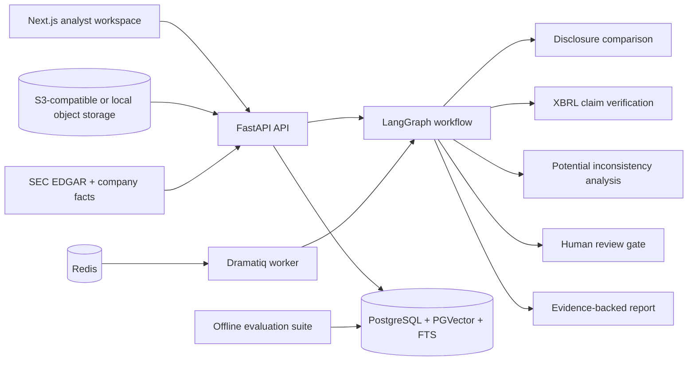
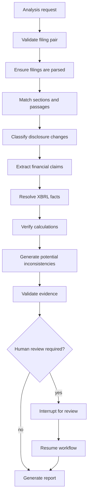

# DeltaLedger AI

DeltaLedger compares financial disclosures across reporting periods, verifies
financial claims against SEC XBRL facts, identifies potential inconsistencies,
and produces evidence-backed analyst reports.

## Problem

Quarterly filings are long, repetitive, and easy to misread across periods.
Simple filing chat tools can retrieve passages, but they usually do not verify
reported numerical claims, preserve deterministic evidence lineage, or separate
potential inconsistencies from reviewed conclusions.

## What It Does

- Ingests SEC 10-Q filing HTML and company-facts/XBRL data.
- Parses filings into sections, tables, passages, chunks, hashes, and citations.
- Retrieves evidence with PostgreSQL full-text search, PGVector, RRF, and optional reranking.
- Compares disclosure language across quarters.
- Extracts financial claims and verifies them against XBRL facts with Decimal arithmetic.
- Flags potential narrative-data inconsistencies for analyst review.
- Orchestrates analysis with LangGraph, PostgreSQL checkpointing, Redis, and Dramatiq.
- Produces structured evidence-backed reports and offline evaluation artifacts.

DeltaLedger is not a stock forecaster, trading system, investment advisor, or
fraud detector.

## Architecture



## Workflow



## AI, ML, And Financial Reasoning

- NLP: filing sectioning, semantic comparison, claim extraction, risk/change classification.
- Deep learning: transformer embeddings and optional cross-encoder reranking.
- Retrieval: dense + lexical hybrid retrieval with reciprocal rank fusion.
- Orchestration: LangGraph state machine with interrupt/resume.
- Financial reasoning: deterministic XBRL fact resolution and Decimal calculations.
- Evaluation: retrieval metrics, classification F1, calibration, false-positive-rate paths, and evidence metrics.

The project uses model providers and deterministic CI-safe fakes; it does not
claim models were trained from scratch.

## Evaluation

Run the offline benchmark from `backend`:

```bash
python -m app.cli.evaluate --suite all --offline --output-dir evaluation/reports
```

Phase 8 reports candidate development metrics only when labelled data exists,
the evaluator actually ran, and the denominator is non-zero. Missing metrics are
reported as `not_evaluated` or `no_data`. Current compact benchmarks include
Phase 3, Phase 4, Phase 5, retrieval, evidence, and calibration utilities. See
[docs/evaluation-suite.md](docs/evaluation-suite.md) and
[docs/quality-gates.md](docs/quality-gates.md).

## Local Setup

Backend:

```bash
cd backend
python -m pip install -e ".[dev]"
python -m alembic upgrade head
python -m uvicorn app.main:app --reload --port 8000
```

Worker:

```bash
cd backend
python -m dramatiq app.workers.tasks
```

Frontend:

```bash
cd frontend
nvm use
npm ci
npm run dev
```

The frontend targets Node `20.20.x` and Next.js `16.3.0`.
Set `NEXT_PUBLIC_API_BASE_URL` when the API is not at
`http://localhost:8000/api/v1`.

## Demo

Create deterministic offline demo data in a migrated local database:

```bash
cd backend
python -m app.cli.seed_demo_data --offline
```

Preview the demo scenario without database writes:

```bash
python -m app.cli.seed_demo_data --manifest-only
```

See [docs/demo-script.md](docs/demo-script.md) for a 5-10 minute walkthrough.

## Production Readiness

Production uses explicit environment configuration and fails fast for unsafe
fallbacks such as filesystem storage, memory checkpointing, wildcard/local CORS,
demo object-storage credentials, placeholder SEC contact details, or fake model
providers unless explicitly overridden.

Recommended commands:

```bash
cd backend
python -m alembic upgrade head
uvicorn app.main:app --host 0.0.0.0 --port $PORT
dramatiq app.workers.tasks
```

Health checks:

- Liveness: `GET /api/v1/health`
- Readiness: `GET /api/v1/ready`
- Deep CLI: `python -m app.cli.health all`

See [docs/deployment.md](docs/deployment.md) and
[docs/production-checklist.md](docs/production-checklist.md).

## Validation

Backend:

```bash
cd backend
python -m pytest -q
python -m ruff check app tests --no-cache --output-format=github
python -m alembic upgrade head --sql
python -m app.cli.evaluate --suite all --offline
```

Frontend:

```bash
cd frontend
npm run lint
npm run typecheck
npm test
npm run build
npm run test:e2e
npm audit
npm audit --omit=dev
```

## Documentation

- [Architecture](docs/architecture.md)
- [Deployment](docs/deployment.md)
- [Security](docs/security.md)
- [Limitations](docs/limitations.md)
- [Demo script](docs/demo-script.md)
- [Portfolio case study](docs/portfolio-case-study.md)
- [Interview guide](docs/interview-guide.md)
- [Resume bullets](docs/resume-bullets.md)

## Responsible Use

DeltaLedger surfaces potential inconsistencies and evidence for analyst review.
It does not determine misconduct, provide investment advice, or replace original
SEC filings as the authoritative source.
