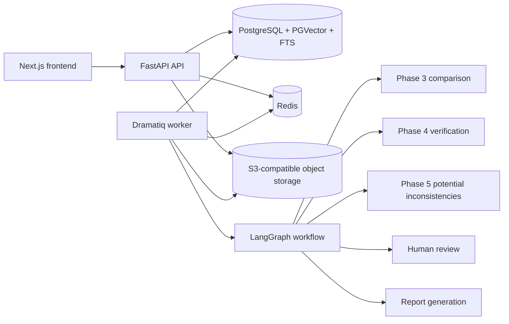
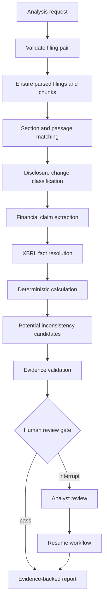
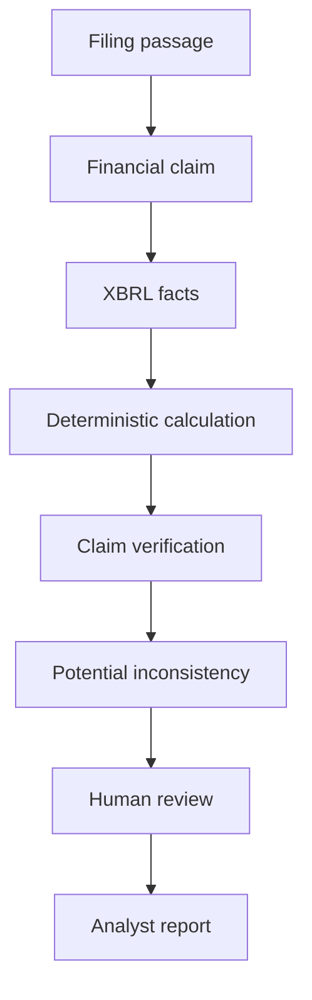

# Architecture Design

## Product Boundary

DeltaLedger AI compares a company's current 10-Q against a previous 10-Q, detects evidence-supported disclosure changes, verifies financial claims against SEC XBRL facts, and flags potential contradictions for human review. It must abstain when evidence is insufficient.

The MVP intentionally excludes investment advice, trading recommendations, portfolio workflows, stock-price prediction, and unsupported narrative summaries.

## System Context

```text
User
  -> Next.js frontend
  -> FastAPI REST API
  -> PostgreSQL/PGVector, Redis, MinIO
  -> background workers
  -> SEC submissions, filing HTML, company facts APIs
  -> model providers and local/Hugging Face models
  -> tracing/evaluation dashboards
```

## Runtime Profiles

- `local-cloud`: FastAPI and Dramatiq run directly in PowerShell, PostgreSQL and
  Redis can be managed services, object storage is filesystem-backed, and
  embeddings are deterministic fake or hosted Hugging Face inference.
- `ci`: GitHub-hosted Ubuntu runners use service containers for PGVector
  PostgreSQL, Redis, and MinIO with deterministic fake models.
- `docker`: backend and worker containers use internal service hostnames:
  `postgres`, `redis`, and `minio`.

## Backend Layers

API layer:

- Versioned `/api/v1` REST endpoints.
- Request validation, pagination, filtering, idempotency-key extraction, response envelopes, and typed errors.
- No business logic and no direct SQLAlchemy queries.

Service layer:

- SEC ingestion, filing parsing, section-aware chunking, embedding generation, retrieval, section matching, disclosure diffing, claim extraction, XBRL verification, contradiction detection, report generation, citation validation, human review, and evaluation.
- Deterministic calculations use Python `Decimal` where financial precision matters.
- LLM calls are structured, versioned, traced, and never authoritative for arithmetic.

Repository layer:

- Owns all SQLAlchemy access.
- Encapsulates unique constraints, idempotency checks, row locking, pagination, and status transitions.

AI orchestration layer:

- LangGraph coordinates stateful analysis workflows.
- LangChain provides model adapters, tools, prompts, and structured output parsing.
- LlamaIndex supports document transformations, indexing, and retrieval utilities.

Integration layer:

- SEC clients use official endpoints, typed exceptions, timeouts, retries, request throttling, and a SEC-compliant User-Agent.
- Storage client abstracts MinIO locally and S3-compatible storage in cloud deployments.
- Tracing client supports LangSmith or OpenTelemetry-compatible backends.

Worker layer:

- Dramatiq with Redis.
- Idempotent jobs, bounded retries, graceful shutdown, and persisted progress events.

## Data Flow

1. User selects company and filings.
2. API creates or reuses an idempotent analysis run.
3. Worker executes or resumes the LangGraph workflow using `checkpoint_thread_id`.
4. Graph verifies filings are ingested.
5. Comparable sections are retrieved and matched using metadata, dense retrieval, lexical retrieval, fusion, reranking, and rule-based section signals.
6. Disclosure changes are detected with deterministic text diffing, semantic similarity, and structured LLM classification.
7. Narrative claims are extracted using controlled metric aliases and structured outputs.
8. Claims are verified against XBRL facts with deterministic period, unit, concept, and calculation logic.
9. Contradiction candidates are generated by rules, then classified/explained by an LLM with evidence constraints.
10. Evidence validation blocks unsupported high-priority findings.
11. Workflow-level human review can approve, reject, partially approve, request
    changes, mark uncertain, or comment.
12. A deterministic structured analysis report is generated with an evidence
    manifest.

## Phase 2 Processing Flow

Downloaded filings are processed by a Redis-backed Dramatiq worker. The worker creates its
own database session and executes `FilingProcessingService`, which performs:

1. Load original SEC HTML from MinIO/S3-compatible storage.
2. Parse sections and tables with `DocumentParserService`.
3. Persist evidence-aware `filing_sections` and `filing_tables`.
4. Generate deterministic section-aware chunks with `ChunkingService`.
5. Embed unchanged chunks only when needed through `EmbeddingService`.
6. Store vectors in PostgreSQL/PGVector and generated `tsvector` data for lexical search.

Routes enqueue work or read stored results; parsing, chunking, embedding, retrieval, and
worker progress logic stay in services and repositories.

## Phase 3 Comparison Flow

Parsed 10-Q filings are compared by `FilingComparisonService` through the same
route, service, repository, database pattern as Phase 2. `POST /api/v1/comparisons`
validates that both filings exist, belong to the same company, are 10-Qs, have
different periods, and already contain parsed sections and chunks. The worker
takes a PostgreSQL advisory lock per comparison before processing.

The comparison worker progresses through:

1. `matching_sections`: combines SEC structure, headings, dense embeddings,
   lexical similarity, reranker scores, and relative section position.
2. `aligning_passages`: segments matched sections into deterministic paragraph
   units and runs monotonic dynamic-programming alignment.
3. `detecting_changes`: classifies added, removed, strengthened, weakened, and
   no-material-change passages with deterministic signals plus a typed classifier.
4. `completed` or `failed`: persists metrics, model names, versions, errors, and
   reviewable disclosure findings.

Findings store current and previous passage evidence, changed spans, materiality
components, model/prompt metadata, and original model output. Reviewer edits are
stored separately so the raw classifier result remains auditable.

## Phase 4 Financial Verification Flow

Financial claim verification follows the existing route, service, repository,
database layering. API routes enqueue extraction or verification jobs and expose
stored results; services own extraction, metric resolution, fact ranking, and
calculation; repositories own SQLAlchemy access to `financial_claims`,
`claim_fact_candidates`, `claim_verifications`, `derived_financial_metrics`, and
the existing `xbrl_facts` table.

The worker uses PostgreSQL advisory locks before filing-level or
comparison-level verification so duplicate jobs do not create duplicate claims or
verification rows. Standard CI keeps `CLAIM_EXTRACTOR_PROVIDER=fake` and does
not call external LLMs, live SEC APIs, or hosted model downloads.

## Phase 6 Workflow Orchestration

Phase 6 introduces `AnalysisWorkflowService`, which builds a typed LangGraph
state machine and orchestrates existing services rather than duplicating their
business logic. FastAPI routes create/read analysis runs; Dramatiq tasks execute
or resume the graph with their own SQLAlchemy session.

LangGraph state contains compact IDs, counters, warnings, and routing metadata.
The database remains authoritative for filings, chunks, comparisons, claims,
verifications, contradiction findings, review requests, events, and reports.

Checkpoint state and business metadata stay separate:

- LangGraph checkpoint store: execution state and interrupt/resume data
- `analysis_runs`: status, node, versions, checkpoint thread, metrics, safe errors
- `analysis_workflow_events`: audit trail for node transitions and review/report events
- `analysis_review_requests`: workflow-level human gate
- `analysis_reports`: authoritative structured report payload

Local and CI tests may use a memory checkpointer. Production configuration must
use PostgreSQL checkpointing.

## Phase 7 Analyst Frontend

Phase 7 adds a Next.js App Router workspace under `frontend/`. It consumes
`/api/v1` through a typed API client and TanStack Query cache layer. The
frontend is organized around analyst workflows rather than chat interaction:
company browsing, valid filing-pair selection, analysis workflow monitoring,
evidence-backed finding inspection, human review, resume, and structured report
presentation.

The UI renders filing text, model summaries, and evidence as untrusted text. It
does not render arbitrary filing HTML. Analysis polling is status-aware and
stops after terminal states. Review and resume mutations disable repeated clicks
and invalidate only the affected workflow queries.

## AI Boundaries

Allowed LLM responsibilities:

- Classify materiality when deterministic filters already found a candidate.
- Explain verification results from deterministic inputs.
- Classify contradiction type from evidence-backed candidates.
- Generate report prose constrained by validated evidence.

Disallowed LLM responsibilities:

- Authoritative financial arithmetic.
- Inventing SEC facts, XBRL concepts, or citations.
- Publishing unsupported findings.
- Replacing section matching, metric mapping, or verification with free-form reasoning.

## Observability

Every analysis records:

- Analysis ID, request ID, workflow version, prompt version, model provider, model name, model parameters.
- Node execution status, duration, retry count, token usage, estimated cost, and structured output validation failures.
- Retrieval candidates, scores, reranker outputs, selected evidence, citation validation results, and human review actions.

Sensitive values must not appear in logs.

Offline evaluation is separated from production request paths. Dataset adapters,
deterministic metric functions, benchmark runners, candidate reports, and
quality gates live under `app/evaluation` and `backend/evaluation`.

## Reliability

- SEC calls use timeouts, retries, throttling, and typed exceptions.
- Creation APIs require idempotency keys.
- Worker jobs can retry failed stages without duplicating unchanged filings.
- Analysis state is checkpointed and resumable after human review.
- Database writes use transaction boundaries and explicit status transitions.

## Production Topology



## Workflow Diagram



## Evidence Lineage


